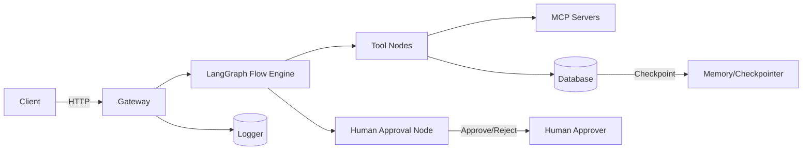
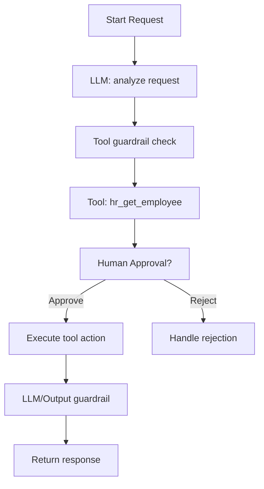
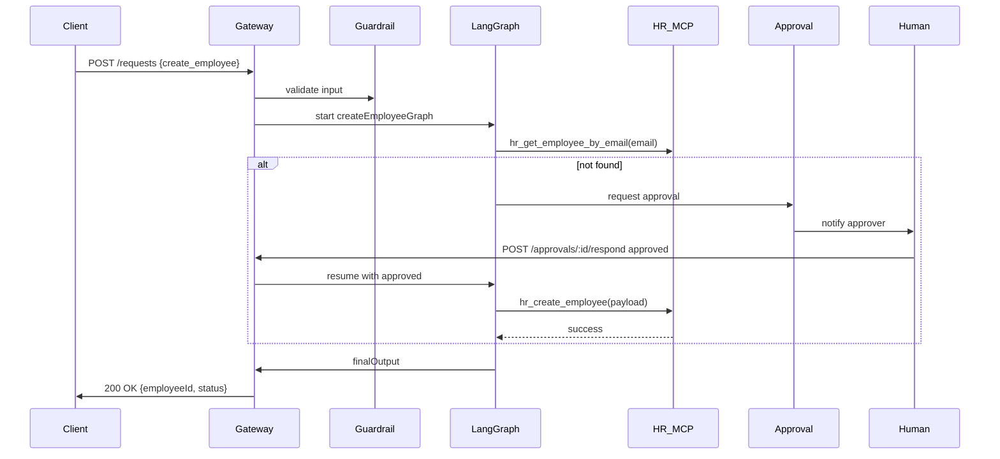

# Gen AI Wrapper: MCP + LangGraph Reference

Comprehensive, production-ready example showcasing LangGraph flows, MCP (Modular Conversational Processing) servers/clients, tool-calling, guardrails, human approval, and checkpointed memory. This README explains architecture, flows, important files, setup and run instructions, diagrams, code snippets, and notes for production and security hardening.

## Project Summary

- **Title:** Gen AI Wrapper — MCP + LangGraph Example
- **Short description:** A mono-repo demonstrating how to orchestrate LLM-driven flows using LangGraph, call domain tools exposed as MCP servers, apply input/tool/output guardrails, require human approvals, and persist checkpoints and memory for resumability and audit.

### Problem this project solves

Building safe, auditable, and extensible AI orchestration systems is complex. This project provides a reference architecture and working code patterns to:

- Orchestrate multi-step LLM workflows with deterministic tool calls.
- Protect pipelines with layered guardrails (input, tool, output/PII).
- Pause for human approval and resume flows safely.
- Persist state and checkpoints for resumability and audits.

## Project Overview

This repository is organized as a monorepo with multiple apps and shared packages. It includes:

- A Gateway app that hosts LangGraph flows, orchestrates execution, applies guardrails, and acts as the central API.
- Several MCP servers (HR, Leave, Finance) that expose domain-specific tools used by flows.
- Shared packages for `config`, `database`, `logger`, and `shared-types` used across services.

The gateway drives LangGraph graphs that combine LLM prompts, tool calls, approvals, and state management. Tool calls go to MCP servers, which implement the operations in a typed, networked form.

## Architecture

High-level components and responsibilities:

- **Client(s):** Initiates high-level requests (HTTP) to the Gateway.
- **Gateway:** Hosts LangGraph flows, applies guardrails, calls MCP clients, persists checkpoints, and exposes approval endpoints.
- **LangGraph:** Flow engine used inside the Gateway; flows are coded as nodes and graphs.
- **MCP servers:** Microservices that expose tools (APIs) for domain tasks (HR, Leave, Finance).
- **Database:** Persistent storage for checkpoints, memory, users, and audit logs.
- **Logger/Observability:** Structured logs and monitors for audit and debugging.

Mermaid - High level



## Folder Structure (overview)

Root important folders:

- `apps/`
  - `gateway/` — orchestrator and LangGraph definitions (`src/index.ts`, `src/graph/`)
  - `hr_mcp_server/`, `leave_mcp_server/`, `finance_mcp_server/` — domain MCP servers
- `packages/`
  - `config/` — environment and config helpers
  - `database/` — DB connection and models (`src/connection/conn.ts`, `src/models/`)
  - `logger/` — structured logging helpers
  - `shared-types/` — TS types used across apps
- `docs/` — reference and design notes

See each app's `src` directory for implementation details and entrypoints.

## Main Tech Stack

- Node.js + TypeScript
- LangGraph (flow orchestration)
- Express/Fastify (gateway HTTP server — see `apps/gateway/src/index.ts`)
- MONGODB   via `packages/database`
- LLM provider integration (configurable)
- Optional: Docker, Redis, Prometheus, OpenTelemetry

## Topics and Concepts Covered

- LangGraph flow design and node types
- MCP server/client tool orchestration
- Guardrails: input, tool, and output (PII) protections
- Human approval workflows and interrupts
- Memory/checkpoint persistence
 

## LangGraph Flow Explanation

LangGraph expresses complex workflows as nodes that run sequentially or conditionally. Typical node types used here:

- LLM nodes (prompt + parse)
- Tool nodes (MCP calls)
- Approval nodes (pause/resume for humans)
- State/Checkpoint nodes (persist progress)

Example flow diagram



## MCP Server / Client Flow

MCP servers are small domain services exposing typed endpoints. The client-side wrapper in the Gateway prepares inputs, authenticates, calls the MCP endpoint, and validates outputs via guardrails.

Typical steps for a tool call:

1. Gateway encounters a Tool node and calls the MCP client wrapper.
2. Wrapper performs input validation (input guardrail).
3. Wrapper sends authenticated HTTP/RPC request to MCP server.
4. MCP server executes domain logic and returns structured data.
5. Gateway applies tool guardrail to the response and continues the flow.

Example MCP client snippet

```ts
// gateway/src/mcp/hrMcpClient.ts (illustrative)
import fetch from 'node-fetch';
export async function getEmployee(employeeId: string) {
  const res = await fetch(`${process.env.HR_MCP_URL}/employee/${employeeId}`, {
    headers: { Authorization: `Bearer ${process.env.MCP_API_KEY}` }
  });
  if (!res.ok) throw new Error('MCP call failed');
  const data = await res.json();
  // apply tool guardrail checks here
  return data;
}
```

## Tool Calling

Tools are first-class actions with:

- Input schema and validation
- Pre-call guardrail enforcement
- Execution (networked or local)
- Post-call validation and sanitization
- Retry/Idempotency and error handling

Best practice: treat tools as typed, permissioned, and audited resources.

## Human Approval / Interrupt Flow

Approval nodes:

1. When a flow requires a human decision, the graph persists a checkpoint and emits an approval request.
2. The approver receives a notification (UI/webhook/email) with context and a callback link.
3. The approver responds (approve/reject) to the Gateway approval endpoint.
4. The Gateway resumes the graph using the saved checkpoint and either executes the approved action or runs the rejection path.

Interrupts:

- The Gateway exposes an interrupt/cancel endpoint to stop a running flow and optionally run compensating actions.

Example approval pseudocode

```ts
// gateway/src/graph/approvalNode.ts (conceptual)
export async function requestApproval(state) {
  const approvalId = await saveApprovalCheckpoint(state);
  notifyHuman(approvalId, state);
  const decision = await waitForDecision(approvalId); // event-driven
  return decision;
}
```

## Guardrails

Guardrails are multi-layered safety checks.

- **Input guardrail** (`apps/gateway/src/graph/guardrails/inputGuardrail.ts`):
  - Validates incoming request shapes, required fields, sizes and blocks disallowed content.
  - Example: enforce length limits and denylist dangerous operations.

- **Tool guardrail** (`apps/gateway/src/graph/guardrails/toolGuardrail.ts`):
  - Ensures only permitted tools are invoked in context, validates tool inputs and outputs, enforces rate limits, and checks permissioning.

- **Output / PII guardrail** (`apps/gateway/src/graph/guardrails/outputGuardrail.ts`):
  - Detects and redacts PII before outputs are returned to clients or stored in logs.
  - Stores redacted originals in encrypted audit logs if required.

Example PII redaction

```ts
function redactPII(text: string) {
  // naive example — replace SSN-like patterns
  return text.replace(/\b\d{3}-\d{2}-\d{4}\b/g, '[REDACTED_SSN]');
}
```

## Memory / Checkpointer

The database persists checkpoints and short-term memory to support resume and audits.

Checkpoint should capture:

- Graph id and node pointer
- Inputs and outputs of tool calls (redacted as needed)
- Approval status and metadata
- Timestamps and actor IDs for audit

Implementation notes:

- Use transactional writes for critical checkpoints.
- Consider append-only logs or event sourcing for immutable audit trails.
- Encrypt sensitive checkpoint fields at rest.

## Environment Variables

Core environment variables used across the repo (check `packages/config` for exact names):

- `NODE_ENV` — development|production
- `PORT` — gateway port
- `DATABASE_URL` — Postgres connection string
- `MCP_API_KEY` — API key for MCP servers
- `HR_MCP_URL` — HR MCP server base URL
- `LEAVE_MCP_URL` — Leave MCP server base URL
- `FINANCE_MCP_URL` — Finance MCP server base URL
- `LLM_PROVIDER_ENDPOINT` — optional external LLM endpoint
- `LLM_API_KEY` — LLM provider API key
- Optional: `REDIS_URL`, `LOG_LEVEL`, `APPROVAL_CALLBACK_URL`

## Installation

Prerequisites:

- Node.js (v18+ recommended)
- npm, yarn, or pnpm
-  Mongodb(or a running DB instance)
- Optional: Docker & docker-compose

Steps (local dev):

```bash
# from repo root
npm install

# populate .env files (copy example if exists)
cp .env.example .env
# edit .env to set DATABASE_URL, MCP urls and keys

# run DB migrations if available
npm run db:migrate

# start gateway
cd apps/gateway
npm run dev

# in another terminal start HR MCP server
cd apps/hr_mcp_server
npm run dev
```

## How to Run

Development:

- Run each app individually with hot-reload (use `npm run dev` in each package).
- Ensure the DB is available and the `*_MCP_URL` env variables point to running services.

Production:

- Build packages: `npm run build` at repo root or per-app.
- Use containers or a process manager (`pm2`, systemd). Ensure env and DB migrations are applied.

## Important Files and Roles

- `apps/gateway/src/index.ts` — Gateway entrypoint, HTTP routes and middleware.
- `apps/gateway/src/graph/graph.ts` — LangGraph flow definitions.
- `apps/gateway/src/graph/approvalNode.ts` — Approval node implementation.
- `apps/gateway/src/graph/executeApprovedToolNode.ts` — Post-approval execution helper.
- `apps/gateway/src/graph/guardrails/*.ts` — Guardrail implementations.
- `apps/gateway/src/mcp/hrMcpClient.ts` — Example MCP client wrapper.
- `apps/hr_mcp_server/src/tools/hrTools.ts` — Example HR tools.
- `packages/database/src/connection/conn.ts` — DB connection setup.
- `packages/database/src/models/employee.model.ts` — Example model.
- `packages/config` — central config parsing.
- `packages/logger` — structured logging utils.

If your local files differ slightly, open the source directories and map the entrypoints accordingly.

## End-to-End Request Flow (example)

Use-case: Create a new employee and request payroll setup.

1. Client POST `/api/v1/requests` with payload `{ type: 'create_employee', payload: { name, email, role } }`.
2. Gateway validates input via input guardrail.
3. Gateway starts `createEmployeeGraph` in LangGraph.
4. LangGraph runs LLM node to structure the request and determine actions.
5. LangGraph calls `hr_get_employee_by_email` via MCP client.
6. If no duplicate, graph creates an approval node and persists a checkpoint.
7. Human approver receives notification and responds via `/approvals/:id/respond`.
8. On approval, the gateway resumes the graph and calls `hr_create_employee` tool.
9. Tool returns success; gateway applies output guardrail and returns final response.

Sequence diagram



## Example User Queries (prompts)

- "Create a new employee Alex Johnson, set role to engineer, enroll in benefits."
- "Request leave for employee 456 from 2026-07-01 to 2026-07-15."
- "Terminate employee 123 and notify payroll."
- "List all pending approvals and reasons."

Each query maps to a LangGraph flow which may call tools and include approvals.

## Key Code Snippets

1. Input guardrail (schema validation)

```ts
// apps/gateway/src/graph/guardrails/inputGuardrail.ts
import Ajv from 'ajv';
const ajv = new Ajv();
export function validate(schema, data) {
  const validate = ajv.compile(schema);
  const ok = validate(data);
  if (!ok) throw new Error('Input validation failed: ' + JSON.stringify(validate.errors));
  return data;
}
```

2. Tool call wrapper with guardrails

```ts
async function callTool(toolFn, args, argsSchema, outputSchema) {
  validate(argsSchema, args);
  const out = await toolFn(args);
  validate(outputSchema, out);
  return out;
}
```

3. Approval checkpoint

```ts
// apps/gateway/src/graph/state.ts
import { getDb } from 'packages/database/src/connection/conn';
export async function saveApprovalCheckpoint(payload) {
  const db = getDb();
  const res = await db.query('INSERT INTO approvals(state) VALUES($1) RETURNING id', [payload]);
  return res.rows[0].id;
}
```

## Production Improvements

- Containerize each service with Docker and add `docker-compose` for local testing.
- CI/CD pipelines: run tests, lint, build images, and deploy with GitHub Actions.
- Observability: integrate OpenTelemetry and Prometheus metrics collection.
- Autoscaling: deploy gateway and MCP servers behind a load balancer and scale horizontally.
- Use message queues (Kafka/RabbitMQ) for async and long-running tasks.

## Security Improvements

- Secrets management with Vault or cloud secret stores (do not rely on env files in production).
- mTLS or OAuth between services and RBAC for APIs.
- Field-level encryption for PII in database and encrypted audit logs.
- Strict schema validation and input sanitization to prevent injection.
- Rate limiting, WAF, and DDoS protections at the network edge.

## Future Scope

- Web-based approver dashboard with realtime notifications.
- Vector DB for long-term memory + retrieval-augmented flows.
- Flow versioning and canary releases for LangGraph graphs.
- Policy engine (OPA) integration for dynamic guardrails.

## Learning Notes (revision-friendly)

- LangGraph: model workflows as nodes and manage state via checkpoints.
- MCP pattern: small domain microservices exposing typed tools.
- Guardrails: enforce at input, tool-call, and output stages.
- Approvals: persist state, notify human, resume flow event-driven.
- Memory: prefer transactional writes and encrypted storage for sensitive fields.
- Testing: mock MCP servers and test guardrails independently.

## Quick Commands

Install dependencies:
```bash
npm install
```

Run gateway (dev):
```bash
cd apps/gateway
npm run dev
```

Run HR MCP server (dev):
```bash
cd apps/hr_mcp_server
npm run dev
```

Run DB migrations (if provided):
```bash
npm run db:migrate
```

---

If you want, I can commit this README to the repository, add a `docker-compose.yml` for local testing, or scaffold a minimal approver UI. Tell me which next step you'd like.
